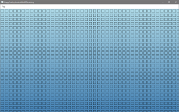

# HappyCoding 2021
## ASP.net Core Blazor
### [BlazorWith3D](HappyCoding.BlazorWith3D)
This project shows how to integrate Three.js or Babylon.js inside ASP.Net Core Blazor. It is implemented for BlazorServer and BlazorClient model.

## Avalonia
### [AvaloniaMarkdownHelpBrowser](HappyCoding.AvaloniaMarkdownHelpBrowser)
This project shows how to implement an integrated Help Browser based on Markdown documents for Avalonia. It offers features like displaying images or navigation by links.

### [AvaloniaSkia2DRendering](HappyCoding.AvaloniaSkia2DRendering)
This project shows how to do custom 2d rendering with SkiaSharp inside Avalonia.

### [AvaloniaSvgImage](HappyCoding.AvaloniaSvgImage)
This project shows some ways how to render svg images inside Avalonia using Svg.Skia.

### [AvaloniaThemeSwitch](HappyCoding.AvaloniaThemeSwitch)
.. in progress

### [AvaloniaWindowFrame](HappyCoding.AvaloniaWindowFrame)
This project shows how to render Avalonia contents over the whole window area.

