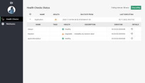

# HappyCoding 2022
## ASP.Net Core
### [HappyCoding.AspNetCoreHealthChecks](HappyCoding.AspNetCoreHealthChecks)
This projects shows how to use HealthChecks with ASP.Net Core and build a monitor application
using [AspNetCore.HealthChecks.UI](https://github.com/Xabaril/AspNetCore.Diagnostics.HealthChecks)

## Avalonia
### [AvaloniaAppWithDataGrid](HappyCoding.AvaloniaAppWithDataGrid)
This project shows how to use the DataGrid control in Avalonia cross-platform apps.

## Misc
### [HappyCoding.YamlParsing](HappyCoding.YamlParsing)
This project implements some samples for parsing yaml data and compare them with json documents

### [HappyCoding.HttpClientServerCalls](HappyCoding.HttpClientServerCalls)
This project shows which http headers are genereated by HttpClient class