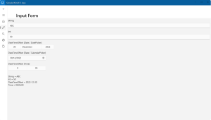

# HappyCoding 2022
## ASP.Net Core
### [AspNetCoreHealthChecks](HappyCoding.AspNetCoreHealthChecks)
This projects shows how to use HealthChecks with ASP.Net Core and build a monitor application
using [AspNetCore.HealthChecks.UI](https://github.com/Xabaril/AspNetCore.Diagnostics.HealthChecks)

### [AspNetCoreSwaggerGen](HappyCoding.AspNetCoreSwaggerGen)
Some API endpoints with generated swagger ui and file

### [AspNetCoreWithHangfire](HappyCoding.AspNetCoreWithHangfire)
A test project for job executing using Hangfire with ASP.NET Core

### [GRpcCommunication](HappyCoding.GRpcCommunication)
This projects does some performance tests with gRPC. It contains a 
client and server gui using Avalonia for easy testing.

### [HexagonalArchitecture](HappyCoding.HexagonalArchitecture)
A sample project for hexagonal architecture with ASP.NET Core 6 and ASP.NET Core Blazor UI

## Avalonia
### [AvaloniaAppWithDataGrid](HappyCoding.AvaloniaAppWithDataGrid)
This project shows how to use the DataGrid control in Avalonia cross-platform apps.

### [AvaloniaFluentThemeSwitch](HappyCoding.AvaloniaFluentThemeSwitch)
A sample project which shows how to change FluentThemeMode at runtime. 
It does also show how to switch theme automatically on Windows when user changes
the Windows theme

### [AvaloniaWithLocalization](HappyCoding.AvaloniaWithLocalization)
A showcase project for Avalonia UI with localization using resx resources

### [ConsoleLogWindow](HappyCoding.ConsoleLogWindow)
A prototype application for hosting console processes in a Avalonia UI application

## Entitfy Framework Core
### [EFCoreFeatures](HappyCoding.EFCoreFeatures)
An experimental project for trying out some features of EF Core

### [EFCoreJsonModelValueConverter](HappyCoding.EFCoreJsonModelValueConverter)
An implementation for a ValueConverter which stores a .NET object in a compressed json field on SQL-Server

### [EFCoreQueryTagging](HappyCoding.EFCoreQueryTagging)
This project shows the query tagging feature of EF Core

### [EFCoreWithBulkExtensions](HappyCoding.EFCoreWithBulkExtensions)
This is an experimental project for using EFCore.BulkExtensions library

### [EFIncludePerformance](HappyCoding.EFIncludePerformance)
I created this project for analyzing a performance issue with Include in EF Core 5 and 6

### [JsonInSqlServer](HappyCoding.JsonInSqlServer)
This projects shows how to store json documents in SQL Server with EF Core 5 and 6

## Misc
### [GeneratePdfUsingQuestPDF](HappyCoding.GeneratePdfUsingQuestPDF)
This project shows how to create pdf files with QuestPDF library

### [ControlledProcessShutdownCall](HappyCoding.ControlledProcessShutdownCall)
This project shows how to trigger shutdown of processes from a .NET application

### [JsonDocumentsWithNevermore](HappyCoding.JsonDocumentsWithNevermore)
This project uses the Nevermore library for storing json documents in SQL Server

### [NServiceBusWithSqlServer](HappyCoding.NServiceBusWithSqlServer)
A small project which uses NServiceBus over SQL Server for sending messages from one application to another

### [SeeingSharp2WithPicking](HappyCoding.SeeingSharp2WithPicking)
A small project which shows how to use picking in SeeingSharp 2

### [SimpleWinUI3App](HappyCoding.SimpleWinUI3App)
A sample project for a WinUI 3 desktop application

### [YamlParsing](HappyCoding.YamlParsing)
This project implements some samples for parsing yaml data and compare them with json documents

### [HttpClientServerCalls](HappyCoding.HttpClientServerCalls)
This project shows which http headers are genereated by HttpClient class